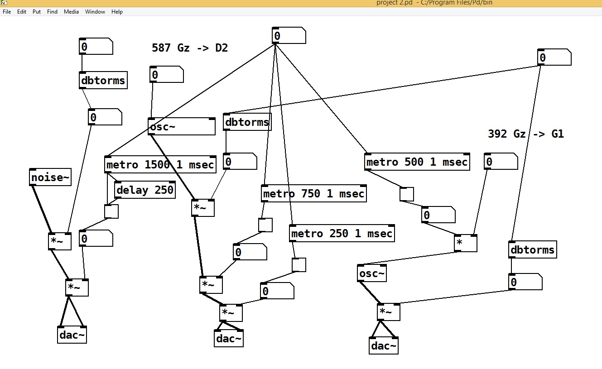
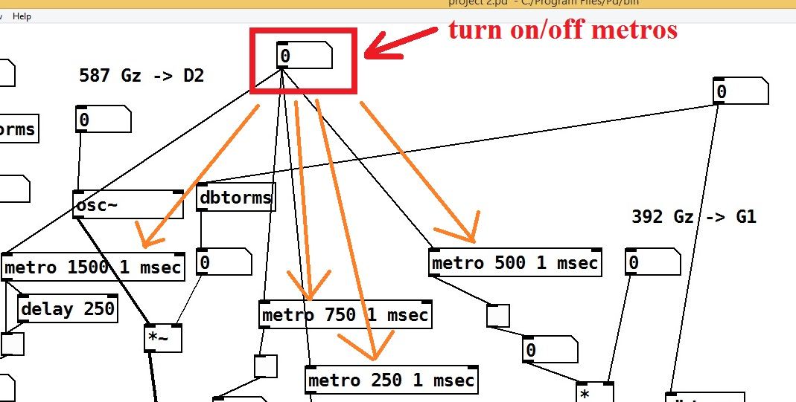
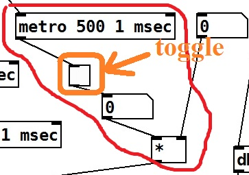

# Max-MSP-Jitter-Beat
 PureData project realizing small music beat

<h2>О PureData</h2>

<b>PureData (Pd)</b> — визуальный язык программирования; аналог Max/MSP/Jitter. Предназначен для создания музыкальных проектов, а также разных мультимедийных (видео, изображения и т.п.) и архитектурных (совместно с платформой Arduino) приложений. Программы на PureData (Max) создаются не классическим способом, путём написания текстовых исходников, а визуальной настройкой и перестановкой различных объектов (осцилляторов, фильтров, функций, чисел и т.д.) и их соединением друг с другом.

Создатель языка: Miller Puckette.

Официальный сайт: https://puredata.info/.

<h2>Пара слов о проекте</h2>

В проекте используется основная традиционная аудио-аппаратура, такая как, осцилляторы (объекты <code>osc~</code>); выходные аудио-устройства (представленные конкретно несколькими программными объектами <code>dac~</code>); метрономы (<code>metro</code>); объекты, выдерживающие заданную паузу (<code>delay</code>); устройства, преобразующие децибелы в десятичное число в диапазоне от нуля до единицы (<code>dbtorms</code>); генератор белого шума (объект <code>noise~</code>), арифметическая операция умножения (<code>*~</code> и <code>*</code>), переключатели (объекты с названием <code>toggle</code>) и обычные целые числа.

Объекты с тильдой наконце, в названии, работают с аналоговыми сигналами, тогда как без тильды — с цифровыми, или дискретными, сигналами.

Чтобы открыть и запустить этот проект у себя на компьютере скачайте и установите PureData с официального сайта и просто кликните, как вариант, дважды по файлу с проектом (файл <code>.pd</code>, лежащий в этом репозитории).

Кроме того, результат работы программы можно посмотреть и на залитом видео: файл <code>Untitled.mp4</code>.

<h2>Полезные ссылки</h2>

<ol>
 <li>Введение в PureData // TVорческая мастерская URL: https://tv-22.ru/vvedenie-v-puredata.html/ (дата обращения: 22.04.2022).</li>
 <li>Max-MSP-Jitter_Gmaj // GitHub URL: https://github.com/LifeSweetener/Max-MSP-Jitter_Gmaj (дата обращения: 23.02.2022).</li>
 <li>Welcome To The Pure Data Site! // Pure Data URL: https://puredata.info/ (дата обращения: 22.04.2022).</li>
</ol>

<h2>Подробности</h2>

<table align="center" id="screen1"><tr><td align="center"></td></tr><tr><td align="center">Скриншот 1 — Общий вид проекта (программы)</td></tr></table>

На <a href="#screen1">скришноте 1</a> показана программа PureData этого репозитория. Поначалу выглядит непонятно, но не бойтесь — здесь нет ничего страшного!) Вы во всём разберётесь, если оно вам нужно. В программе всего имеется три основных музыкальных линии (три голоса):
 <ol>
  <li>это нота соль первой октавы (G1) (часть аппаратуры справа),</li>
  <li>нота ре второй октавы (D2) (совокупность устройств посередине схемы)</li>
  <li>и белый шум для разнообразия (часть проекта слева; объект <code>noise~</code>).</li>
</ol>

Эти три основных линии (голоса) в процессе воспроизведения получившейся маленькой композиции — периодически сменяют друг друга либо звучат вместе. Всё зависит от периода времени, установленного как число-аргумент в объекте <i>метронома</i> <code>metro</code> (как вы уже правильно заметили, их несколько).

«Метроно́м (от греч. μέτρον «мера» + νόμος «закон») — прибор, отмечающий короткие промежутки времени равномерными ударами. В основном используется музыкантами как точный ориентир темпа при исполнении музыкального произведения...» (подробно см., например, в Википедии <a href="https://ru.wikipedia.org/wiki/%D0%9C%D0%B5%D1%82%D1%80%D0%BE%D0%BD%D0%BE%D0%BC">Метрономы Вики</a>). В программе эти метрономы как раз и задают темп каждого голоса и, получается, ритм всего произведения в целом.

При запуске мелодии все метрономы нужно сначала включить: установить число в самом верху программы в единицу (см. <a href="#screen2">скриншот 2 ниже</a>).

<table align="center" id="screen2"><tr><td align="center"></td></tr><tr><td align="center">Скриншот 2 — Выключатель всех метрономов программы</td></tr></table>

Абсолютно каждый метроном управляет своим переключателем (англ. <code>toggle</code>), изображённым на <a href="#screen3">скриншоте 3</a>. Он поочерёдно при каждом ударе метронома выставляет на свой выход то единицу, то ноль. В результате соответствующий голос композиции то играет, то затихает (при умножении сигнала на ноль — будет ноль).

<table align="center" id="screen3"><tr><td align="center"></td></tr><tr><td align="center">Скриншот 3 — Один из метрономов проекта и его переключатель</td></tr></table>

